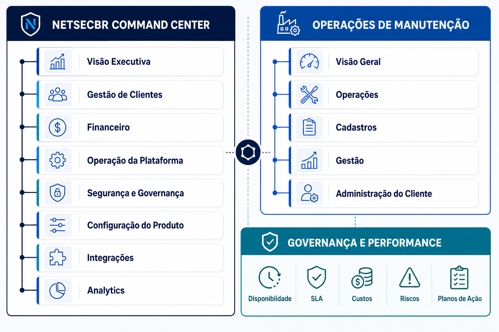

# Arquitetura de Navegação e Funções

## Propósito

Esta é a referência única para os ambientes, menus e níveis de função do produto. Ela separa claramente a operação global da NETSECBR da operação diária de cada cliente. Um usuário vê apenas os recursos permitidos pelo seu perfil e tenant.



## Nível 1 — NETSECBR Command Center

Ambiente global, acessível apenas a perfis NETSECBR autorizados. Seu foco é administrar a plataforma SaaS, e não executar manutenção de um cliente.

```text
NETSECBR Command Center
├── Visão Executiva
│   ├── Clientes ativos, novos e em risco
│   ├── Receita, faturas vencidas e inadimplência
│   ├── Robôs licenciados, franquias e uso
│   ├── Adoção por cliente e usuários ativos
│   ├── Saúde da plataforma e incidentes
│   └── Alertas executivos e pendências críticas
│
├── Gestão de Clientes
│   ├── Tenants
│   │   ├── Dados cadastrais e status
│   │   ├── Situação operacional e acesso
│   │   └── Consulta assistida da operação do tenant
│   ├── Contratos SaaS
│   │   ├── Vigência, degustação e renovação
│   │   ├── Planos, licenças e franquias customizadas
│   │   └── Regras de bloqueio por inadimplência
│   └── Relacionamento e suporte do cliente
│
├── Financeiro
│   ├── Planos e tabela comercial
│   ├── Faturas
│   ├── Pagamentos, PIX e cartão
│   ├── Cobrança, inadimplência e bloqueios
│   └── Receita, impostos e conciliação futura
│
├── Operação da Plataforma
│   ├── Chamados de suporte
│   ├── Jobs, filas e notificações
│   ├── Logs técnicos e erros
│   ├── Saúde de integrações e serviços
│   └── Sandboxes e manutenção programada futura
│
├── Segurança e Governança
│   ├── Usuários globais NETSECBR
│   ├── Perfis globais e acessos privilegiados
│   ├── Política de senha, sessão e recuperação
│   ├── Auditoria de ações administrativas
│   └── Privacidade, LGPD e retenção de dados
│
├── Configuração do Produto
│   ├── Catálogo de permissões e funcionalidades
│   ├── Feature flags e liberação por plano/tenant
│   ├── Configurações de comunicação e e-mail
│   ├── Integrações habilitadas
│   └── Rótulos, padrões e design system NETSECBR
│
├── Integrações
│   ├── Gateways de pagamento
│   ├── E-mail e canais de comunicação
│   ├── Supabase, Storage e serviços de backend
│   └── Monitoramento e conectores futuros
│
└── Analytics
    ├── Crescimento e receita
    ├── Uso por cliente, unidade e funcionalidade
    ├── Capacidade, armazenamento e consumo
    └── Relatórios administrativos
```

## Nível 1 — Operações de Manutenção

Ambiente do tenant. É a área de trabalho do operador, técnico, líder, comprador, gestor e administrador do cliente. A navegação é limitada por permissões e linguagem orientada à ação.

```text
Operações de Manutenção
├── Visão Geral
│   ├── Minha agenda e minhas tarefas
│   ├── Pendências, alertas e notificações
│   ├── Ativos críticos e parados
│   └── Indicadores operacionais essenciais
│
├── Operações
│   ├── Solicitações de manutenção
│   │   ├── Abrir solicitação
│   │   ├── Triar, priorizar e cancelar
│   │   └── Converter em ordem de serviço
│   ├── Ordens de serviço
│   │   ├── Criar, executar e atualizar
│   │   ├── Responsáveis, prazo, prioridade e status
│   │   ├── Checklist, foto, anexos e relato por texto/ditado
│   │   ├── Peças, custos, tempos e evidências
│   │   └── Acionamento de fornecedor e SLA futuro
│   ├── Planejamento
│   │   ├── Preventivas e calendário futuro
│   │   └── Checklists e rotas futuras
│   └── Compras
│       ├── Requisições da OS
│       ├── Aprovação
│       ├── Envio ao fornecedor
│       └── Recebimento e retorno da OS à execução
│
├── Cadastros
│   ├── Ativos e robôs
│   │   ├── Categoria, fabricante, modelo e série
│   │   ├── Unidade, centro de custo e criticidade
│   │   ├── Ficha técnica, IP e monitoramento futuro
│   │   └── Posse, contratos e responsabilidade externa futuros
│   ├── Categorias de ativos
│   ├── Unidades e centros de custo
│   ├── Fornecedores
│   ├── Catálogo de peças e serviços futuro
│   └── Importação CSV e integrações ERP futuras
│
├── Gestão
│   ├── Financeiro e contratos operacionais
│   │   ├── Custos de manutenção e peças
│   │   ├── Custos por ativo, unidade e fornecedor
│   │   ├── Orçamento e centros de custo futuros
│   │   └── Contratos de locação, comodato, leasing e terceiros
│   ├── Fornecedores e SLA
│   ├── Relatórios operacionais
│   └── Governança e Performance
│
└── Administração do Cliente
    ├── Usuários, perfis e permissões
    ├── Dados organizacionais
    ├── Minha Conta NETSECBR
    │   ├── Plano, licenças e franquias
    │   ├── Faturas e pagamentos do SaaS
    │   └── Dados de cobrança
    ├── Integrações e importações
    ├── Identidade de relatórios
    └── Configurações permitidas do tenant
```

## Nível 1 — Governança e Performance

Camada executiva do cliente, construída sobre os dados operacionais. Nenhum indicador é uma fonte isolada: todo número deve permitir chegar ao ativo, OS, fornecedor, contrato, custo ou evidência que o originou.

```text
Governança e Performance
├── Disponibilidade e Downtime
│   ├── Equipamento, linha, unidade e período
│   ├── Horas produtivas x indisponíveis
│   ├── MTBF e MTTR
│   └── Principais causas de parada
├── SLA e Fornecedores
│   ├── Atendimento, resposta e solução
│   ├── Violações e tendência
│   ├── Scorecard de fornecedor
│   └── Pendências e reincidência
├── Custos e Contratos
│   ├── Preventiva x corretiva
│   ├── Peças, mão de obra e terceiros
│   ├── Locação e indisponibilidade proporcional
│   └── Impacto produtivo estimado
├── Riscos
│   ├── Ativos críticos
│   ├── Falhas recorrentes
│   ├── Preventivas vencidas
│   └── Riscos sem mitigação
├── Planos de Ação
│   ├── Origem, responsável, prazo e prioridade
│   ├── Causa-raiz e evidência
│   ├── Benefício esperado
│   └── Validação de eficácia
└── Fechamento Executivo futuro
    ├── Relatório mensal e anual
    ├── Comparação por período e meta
    └── Reunião de governança e decisões
```

## Regras de acesso e evolução

- O menu é sempre calculado por perfil, permissões e tenant.
- Recursos não implementados não aparecem como telas vazias; são liberados quando houver fluxo funcional e autorização comercial.
- O Command Center não é exibido para usuários comuns de cliente.
- A navegação do cliente deve privilegiar tarefas de campo; a camada de Governança atende líderes e gestores.
- O design system deve manter consistência entre os três ambientes, preservando o contexto de cada um.
